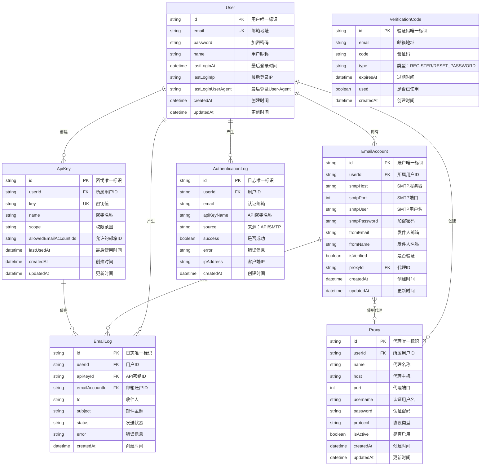

# 数据库设计文档

## 数据库概述

本项目使用 Prisma ORM 作为数据库访问层，开发环境使用 SQLite，生产环境可迁移至 PostgreSQL 或 MySQL。

### 技术选型

| 环境 | 数据库 | 说明 |
|------|--------|------|
| 开发环境 | SQLite | 轻量级、零配置、便于开发调试 |
| 生产环境 | PostgreSQL | 高性能、支持并发、数据安全 |

---

## ER 图



---

## 数据表详细说明

### 1. User 表（用户表）

存储系统用户信息。

**表名**: `users`

| 字段名 | 类型 | 约束 | 默认值 | 说明 |
|--------|------|------|--------|------|
| id | String | PRIMARY KEY | cuid() | 用户唯一标识 |
| email | String | UNIQUE, NOT NULL | - | 邮箱地址 |
| password | String | NOT NULL | - | bcrypt 加密的密码 |
| name | String | NULL | - | 用户昵称 |
| lastLoginAt | DateTime | NULL | - | 最后登录时间 |
| lastLoginIp | String | NULL | - | 最后登录 IP |
| lastLoginUserAgent | String | NULL | - | 最后登录 User-Agent |
| createdAt | DateTime | NOT NULL | now() | 创建时间 |
| updatedAt | DateTime | NOT NULL | updatedAt | 更新时间 |

**索引设计**

| 索引名 | 字段 | 类型 | 说明 |
|--------|------|------|------|
| PRIMARY | id | 主键索引 | 主键查询 |
| users_email_key | email | 唯一索引 | 邮箱唯一性约束、登录查询 |

**Prisma Schema**

```prisma
model User {
  id                   String         @id @default(cuid())
  email                String         @unique
  password             String
  name                 String?
  lastLoginAt          DateTime?
  lastLoginIp          String?
  lastLoginUserAgent   String?
  createdAt            DateTime       @default(now())
  updatedAt            DateTime       @updatedAt
  emailAccounts        EmailAccount[]
  apiKeys              ApiKey[]
  emailLogs            EmailLog[]
  proxies              Proxy[]

  @@map("users")
}
```

---

### 2. EmailAccount 表（邮箱账户表）

存储用户绑定的 SMTP 邮箱账户信息。

**表名**: `email_accounts`

| 字段名 | 类型 | 约束 | 默认值 | 说明 |
|--------|------|------|--------|------|
| id | String | PRIMARY KEY | cuid() | 账户唯一标识 |
| userId | String | FOREIGN KEY, NOT NULL | - | 所属用户 ID |
| smtpHost | String | NOT NULL | - | SMTP 服务器地址 |
| smtpPort | Int | NOT NULL | - | SMTP 端口号 |
| smtpUser | String | NOT NULL | - | SMTP 用户名 |
| smtpPassword | String | NOT NULL | - | AES-256 加密的密码 |
| fromEmail | String | NOT NULL | - | 发件人邮箱地址 |
| fromName | String | NULL | - | 发件人显示名称 |
| isVerified | Boolean | NOT NULL | false | SMTP 是否验证通过 |
| proxyId | String | FOREIGN KEY, NULL | - | 代理 ID |
| createdAt | DateTime | NOT NULL | now() | 创建时间 |
| updatedAt | DateTime | NOT NULL | updatedAt | 更新时间 |

**索引设计**

| 索引名 | 字段 | 类型 | 说明 |
|--------|------|------|------|
| PRIMARY | id | 主键索引 | 主键查询 |
| email_accounts_userId_idx | userId | 普通索引 | 按用户查询邮箱列表 |

**外键约束**

| 字段 | 引用表 | 引用字段 | 删除行为 |
|------|--------|----------|----------|
| userId | users | id | CASCADE（级联删除） |
| proxyId | proxies | id | SET NULL（设为空） |

**Prisma Schema**

```prisma
model EmailAccount {
  id           String     @id @default(cuid())
  userId       String
  smtpHost     String
  smtpPort     Int
  smtpUser     String
  smtpPassword String
  fromEmail    String
  fromName     String?
  isVerified   Boolean    @default(false)
  proxyId      String?
  createdAt    DateTime   @default(now())
  updatedAt    DateTime   @updatedAt
  user         User       @relation(fields: [userId], references: [id], onDelete: Cascade)
  proxy        Proxy?     @relation(fields: [proxyId], references: [id], onDelete: SetNull)
  emailLogs    EmailLog[]

  @@map("email_accounts")
}
```

---

### 3. Proxy 表（代理表）

存储用户配置的代理服务器信息，用于 SMTP 连接代理。

**表名**: `proxies`

| 字段名 | 类型 | 约束 | 默认值 | 说明 |
|--------|------|------|--------|------|
| id | String | PRIMARY KEY | cuid() | 代理唯一标识 |
| userId | String | FOREIGN KEY, NOT NULL | - | 所属用户 ID |
| name | String | NOT NULL | - | 代理名称 |
| host | String | NOT NULL | - | 代理主机地址 |
| port | Int | NOT NULL | - | 代理端口号 |
| username | String | NULL | - | 认证用户名（可选） |
| password | String | NULL | - | 认证密码（可选，加密存储） |
| protocol | String | NOT NULL | "HTTP" | 协议类型：HTTP/SOCKS5 |
| isActive | Boolean | NOT NULL | true | 是否启用 |
| createdAt | DateTime | NOT NULL | now() | 创建时间 |
| updatedAt | DateTime | NOT NULL | updatedAt | 更新时间 |

**索引设计**

| 索引名 | 字段 | 类型 | 说明 |
|--------|------|------|------|
| PRIMARY | id | 主键索引 | 主键查询 |
| proxies_userId_idx | userId | 普通索引 | 按用户查询代理列表 |

**外键约束**

| 字段 | 引用表 | 引用字段 | 删除行为 |
|------|--------|----------|----------|
| userId | users | id | CASCADE（级联删除） |

**protocol 字段说明**

| 值 | 说明 |
|------|------|
| HTTP | HTTP 代理 |
| SOCKS5 | SOCKS5 代理 |

**Prisma Schema**

```prisma
model Proxy {
  id           String          @id @default(cuid())
  userId       String
  name         String
  host         String
  port         Int
  username     String?
  password     String?
  protocol     String          @default("HTTP")
  isActive     Boolean         @default(true)
  createdAt    DateTime        @default(now())
  updatedAt    DateTime        @updatedAt
  user         User            @relation(fields: [userId], references: [id], onDelete: Cascade)
  emailAccounts EmailAccount[]

  @@map("proxies")
}
```

---

### 4. ApiKey 表（API 密钥表）

存储用户创建的 API 密钥信息。

**表名**: `api_keys`

| 字段名 | 类型 | 约束 | 默认值 | 说明 |
|--------|------|------|--------|------|
| id | String | PRIMARY KEY | cuid() | 密钥唯一标识 |
| userId | String | FOREIGN KEY, NOT NULL | - | 所属用户 ID |
| key | String | UNIQUE, NOT NULL | - | API 密钥值（ea_live_xxx） |
| name | String | NOT NULL | - | 密钥名称 |
| scope | String | NOT NULL | "ALL" | 权限范围：ALL/SPECIFIC |
| allowedEmailAccountIds | String | NULL | - | JSON 格式的允许邮箱 ID 列表 |
| lastUsedAt | DateTime | NULL | - | 最后使用时间 |
| createdAt | DateTime | NOT NULL | now() | 创建时间 |
| updatedAt | DateTime | NOT NULL | updatedAt | 更新时间 |

**索引设计**

| 索引名 | 字段 | 类型 | 说明 |
|--------|------|------|------|
| PRIMARY | id | 主键索引 | 主键查询 |
| api_keys_key_key | key | 唯一索引 | 密钥唯一性、认证查询 |
| api_keys_userId_idx | userId | 普通索引 | 按用户查询密钥列表 |

**外键约束**

| 字段 | 引用表 | 引用字段 | 删除行为 |
|------|--------|----------|----------|
| userId | users | id | CASCADE（级联删除） |

**scope 字段说明**

| 值 | 说明 |
|------|------|
| ALL | 可使用用户所有邮箱账户发送邮件 |
| SPECIFIC | 仅可使用指定邮箱账户发送邮件 |

**allowedEmailAccountIds 字段格式**

```json
["clxxx...", "clyyy..."]
```

**Prisma Schema**

```prisma
model ApiKey {
  id                     String              @id @default(cuid())
  userId                 String
  key                    String              @unique
  name                   String
  scope                  String              @default("ALL")
  allowedEmailAccountIds String?
  lastUsedAt             DateTime?
  createdAt              DateTime            @default(now())
  updatedAt              DateTime            @updatedAt
  user                   User                @relation(fields: [userId], references: [id], onDelete: Cascade)
  emailLogs              EmailLog[]

  @@map("api_keys")
}
```

---

### 5. AuthenticationLog 表（认证日志表）

记录用户的认证日志，包括 SMTP 和 HTTP API 两种来源。

**表名**: `authentication_logs`

| 字段名 | 类型 | 约束 | 默认值 | 说明 |
|--------|------|------|--------|------|
| id | String | PRIMARY KEY | cuid() | 日志唯一标识 |
| userId | String | FOREIGN KEY, NOT NULL | - | 用户 ID |
| email | String | NOT NULL | - | 认证使用的邮箱地址 |
| apiKeyName | String | NULL | - | API 密钥名称（直接存储字符串，非外键） |
| source | String | NOT NULL | "SMTP" | 认证来源：API/SMTP |
| success | Boolean | NOT NULL | false | 认证是否成功 |
| error | String | NULL | - | 错误信息（失败时记录） |
| ipAddress | String | NULL | - | 客户端 IP 地址 |
| createdAt | DateTime | NOT NULL | now() | 创建时间 |

**索引设计**

| 索引名 | 字段 | 类型 | 说明 |
|--------|------|------|------|
| PRIMARY | id | 主键索引 | 主键查询 |
| authentication_logs_userId_createdAt_idx | userId, createdAt | 复合索引 | 按用户和时间范围查询日志 |

**外键约束**

| 字段 | 引用表 | 引用字段 | 删除行为 |
|------|--------|----------|----------|
| userId | users | id | CASCADE（级联删除） |

**source 字段说明**

| 值 | 说明 |
|------|------|
| SMTP | SMTP 协议认证 |
| API | HTTP API 认证 |

**Prisma Schema**

```prisma
model AuthenticationLog {
  id           String     @id @default(cuid())
  userId       String
  email        String
  apiKeyName   String?
  source       String     @default("SMTP")
  success      Boolean    @default(false)
  error        String?
  ipAddress    String?
  createdAt    DateTime   @default(now())
  user         User       @relation(fields: [userId], references: [id], onDelete: Cascade)

  @@index([userId, createdAt])
  @@map("authentication_logs")
}
```

---

### 6. EmailLog 表（邮件日志表）

记录所有邮件发送记录。

**表名**: `email_logs`

| 字段名 | 类型 | 约束 | 默认值 | 说明 |
|--------|------|------|--------|------|
| id | String | PRIMARY KEY | cuid() | 日志唯一标识 |
| userId | String | FOREIGN KEY, NOT NULL | - | 用户 ID |
| apiKeyId | String | FOREIGN KEY, NULL | - | 使用的 API 密钥 ID |
| emailAccountId | String | FOREIGN KEY, NOT NULL | - | 使用的邮箱账户 ID |
| to | String | NOT NULL | - | 收件人邮箱（多个以逗号分隔） |
| subject | String | NOT NULL | - | 邮件主题 |
| status | String | NOT NULL | - | 发送状态：SUCCESS/FAILED |
| error | String | NULL | - | 错误信息（失败时记录） |
| createdAt | DateTime | NOT NULL | now() | 创建时间 |

**索引设计**

| 索引名 | 字段 | 类型 | 说明 |
|--------|------|------|------|
| PRIMARY | id | 主键索引 | 主键查询 |
| email_logs_userId_idx | userId | 普通索引 | 按用户查询日志 |
| email_logs_apiKeyId_idx | apiKeyId | 普通索引 | 按密钥查询日志 |
| email_logs_emailAccountId_idx | emailAccountId | 普通索引 | 按邮箱查询日志 |
| email_logs_createdAt_idx | createdAt | 普通索引 | 按时间查询日志 |

**外键约束**

| 字段 | 引用表 | 引用字段 | 删除行为 |
|------|--------|----------|----------|
| userId | users | id | CASCADE（级联删除） |
| apiKeyId | api_keys | id | SET NULL（设为空） |
| emailAccountId | email_accounts | id | CASCADE（级联删除） |

**status 字段说明**

| 值 | 说明 |
|------|------|
| SUCCESS | 邮件发送成功 |
| FAILED | 邮件发送失败 |

**Prisma Schema**

```prisma
model EmailLog {
  id              String        @id @default(cuid())
  userId          String
  apiKeyId        String?
  emailAccountId  String
  to              String
  subject         String
  status          String
  error           String?
  createdAt       DateTime      @default(now())
  user            User          @relation(fields: [userId], references: [id], onDelete: Cascade)
  apiKey          ApiKey?       @relation(fields: [apiKeyId], references: [id], onDelete: SetNull)
  emailAccount    EmailAccount  @relation(fields: [emailAccountId], references: [id], onDelete: Cascade)

  @@map("email_logs")
}
```

---

### 7. VerificationCode 表（验证码表）

存储邮箱验证码和密码重置令牌。

**表名**: `verification_codes`

| 字段名 | 类型 | 约束 | 默认值 | 说明 |
|--------|------|------|--------|------|
| id | String | PRIMARY KEY | cuid() | 验证码唯一标识 |
| email | String | NOT NULL | - | 邮箱地址 |
| code | String | NOT NULL | - | 验证码（6位数字或64字符token） |
| type | String | NOT NULL | - | 类型：REGISTER/RESET_PASSWORD |
| expiresAt | DateTime | NOT NULL | - | 过期时间 |
| used | Boolean | NOT NULL | false | 是否已使用 |
| createdAt | DateTime | NOT NULL | now() | 创建时间 |

**索引设计**

| 索引名 | 字段 | 类型 | 说明 |
|--------|------|------|------|
| PRIMARY | id | 主键索引 | 主键查询 |
| verification_codes_email_type_idx | email, type | 复合索引 | 查询验证码 |

**type 字段说明**

| 值 | 说明 |
|------|------|
| REGISTER | 注册验证码 |
| RESET_PASSWORD | 重置密码令牌 |

**Prisma Schema**

```prisma
model VerificationCode {
  id        String   @id @default(cuid())
  email     String
  code      String
  type      String
  expiresAt DateTime
  used      Boolean  @default(false)
  createdAt DateTime @default(now())

  @@index([email, type])
  @@map("verification_codes")
}
```

---

## 表关系说明

### 关系图

```
┌─────────────┐       ┌──────────────────┐       ┌──────────────────┐
│    User     │       │  EmailAccount    │       │      Proxy       │
├─────────────┤       ├──────────────────┤       ├──────────────────┤
│ id (PK)     │◄──────│ userId (FK)      │       │ id (PK)          │
│ email (UK)  │  1:N  │ id (PK)          │──────►│ userId (FK)      │
│ password    │       │ smtpHost         │  N:1  │ name             │
│ name        │       │ smtpPort         │       │ host             │
│ lastLoginAt │       │ smtpUser         │       │ port             │
│ lastLoginIp │       │ smtpPassword     │       │ username         │
│ lastLoginUA │       │ fromEmail        │       │ password         │
│ createdAt   │       │ fromName         │       │ protocol         │
│ updatedAt   │       │ isVerified       │       │ isActive         │
└─────────────┘       │ proxyId (FK)     │──────►│ createdAt        │
      │               └──────────────────┘  N:1  │ updatedAt        │
      │ 1:N                 │                   └──────────────────┘
      │                     │ 1:N
      │                     │
      ▼                     ▼
┌─────────────┐       ┌──────────────────┐
│   ApiKey    │       │    EmailLog      │
├─────────────┤       ├──────────────────┤
│ id (PK)     │◄──────│ id (PK)          │
│ userId (FK) │  1:N  │ userId (FK)      │
│ key (UK)    │       │ apiKeyId (FK)    │
│ name        │       │ emailAccountId   │
│ scope       │       │ to               │
│ allowedIds  │       │ subject          │
│ lastUsedAt  │       │ status           │
│ createdAt   │       │ error            │
│ updatedAt   │       │ createdAt        │
└─────────────┘       └──────────────────┘       ┌─────────────────────┐
                                            │  AuthenticationLog  │
                                           ├─────────────────────┤
                                           │ id (PK)             │
                                           │ userId (FK)         │
                                           │ email               │
                                           │ apiKeyName          │
                                           │ source              │
                                           │ success             │
                                           │ error               │
                                           │ ipAddress           │
                                           │ createdAt           │
                                           └─────────────────────┘

┌─────────────────────┐
│  VerificationCode   │  （独立表，无外键关联）
├─────────────────────┤
│ id (PK)             │
│ email               │
│ code                │
│ type                │
│ expiresAt           │
│ used                │
│ createdAt           │
└─────────────────────┘
```

### 关系说明

| 关系 | 类型 | 说明 |
|------|------|------|
| User → EmailAccount | 一对多 | 一个用户可以绑定多个邮箱账户 |
| User → ApiKey | 一对多 | 一个用户可以创建多个 API 密钥 |
| User → EmailLog | 一对多 | 一个用户可以有多条发送记录 |
| User → Proxy | 一对多 | 一个用户可以创建多个代理配置 |
| User → AuthenticationLog | 一对多 | 一个用户可以有多条认证日志 |
| EmailAccount → EmailLog | 一对多 | 一个邮箱账户可以发送多封邮件 |
| EmailAccount → Proxy | 多对一 | 多个邮箱账户可以共享一个代理（可选） |
| ApiKey → EmailLog | 一对多 | 一个密钥可以用于多次发送 |

---

## 数据安全

### 密码加密

用户密码使用 bcryptjs 加密存储：

- 加密算法：bcrypt
- 盐值轮数：12
- 存储格式：`$2a$12$...`

### SMTP 密码加密

邮箱 SMTP 密码使用 AES-256-CBC 加密存储：

- 加密算法：AES-256-CBC
- 密钥来源：环境变量 `ENCRYPTION_KEY`（32 字符）
- 存储格式：`{iv}:{encryptedData}`（十六进制）

### API 密钥格式

- 前缀：`ea_live_`
- 随机部分：64 位十六进制字符串
- 总长度：72 字符

---

## 数据库迁移

### 开发环境（SQLite）

```bash
npx prisma db push
```

### 生产环境（PostgreSQL）

1. 修改 `prisma/schema.prisma`：

```prisma
datasource db {
  provider = "postgresql"
  url      = env("DATABASE_URL")
}
```

2. 创建迁移：

```bash
npx prisma migrate dev --name init
```

3. 生产部署：

```bash
npx prisma migrate deploy
```

---

## 数据库维护

### 备份策略

**SQLite 备份**

```bash
cp prisma/dev.db prisma/dev.db.backup
```

**PostgreSQL 备份**

```bash
pg_dump -U username -d dbname > backup.sql
```

### 数据清理

清理 30 天前的邮件日志：

```sql
DELETE FROM email_logs WHERE createdAt < datetime('now', '-30 days');
```

### 性能优化建议

1. 定期清理历史邮件日志
2. 为高频查询字段添加索引
3. 生产环境使用 PostgreSQL 连接池
4. 大数据量时考虑分表存储邮件日志
